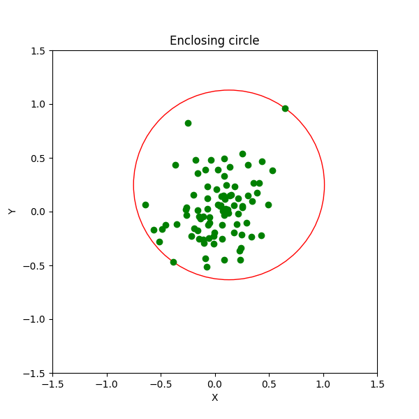

# Smallest enclosing circle  
  
  
## Description  
  
This labwork implements smallest enclosing circle algorithm. You can read more [here](https://en.wikipedia.org/wiki/Smallest-circle_problem).  This code generates a set of 88 normally distributed points in the [-1,1]^2 square (or reads from file), and then builds an enclosing circle for them. Afterwards the input points and the resulting circle is shown using [matplotlib](https://matplotlib.org/stable/index.html).
  
## How to run  
If needed, create virtualenv:  
  
    $ python3 -m venv venv
    $ source venv/bin/activate  
  Install the required packages:

    $ pip3 install -r requirements.txt

Run the labwork:  
  
    $ python3 main.py

Once you run the code, you will be prompted to choose the source for starting points - you can have the points randomly generated or loaded from `input.txt` file, where points are specified (one point per line). Once you've chosen the desired input type, algorithm will start processing your points and then display the result.

You can also test the algorithm module by running Unit tests:

    $ python3 test.py

